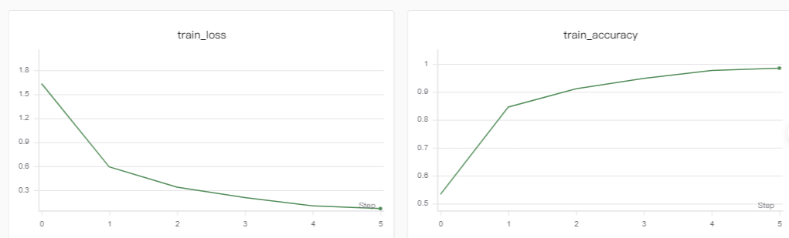
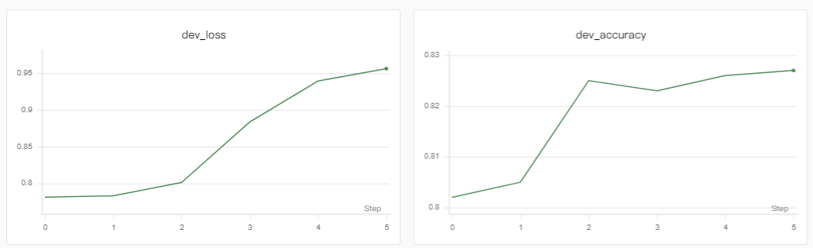

# 基于 BERT 的今日头条新闻文本分类任务

## 项目简介

本项目使用 Hugging Face 的 `google-bert/bert-base-chinese` 预训练模型，
完成今日头条新闻标题的多分类任务。

项目基于 PyTorch 实现数据预处理、模型构建、训练、验证和测试流程，
并使用 SwanLab 记录训练过程中的 Loss 和 Accuracy 曲线。

## 数据集

使用今日头条文本分类数据集，共 15 个类别。

| 数据集 | 文件名 | 数量 |
|---|---|---:|
| 训练集 | `train_3k.txt` | 3000 |
| 验证集 | `dev_1k.txt` | 1000 |
| 测试集 | `test_1k.txt` | 1000 |

每条数据的格式如下：
```text
新闻ID_!_数字标签_!_类别名称_!_新闻标题_!_关键词
```
## 项目结构
```text
Demo1/
├── data/
│   ├── train_3k.txt
│   ├── dev_1k.txt
│   └── test_1k.txt
├── outputs/
├── config.json
├── dataset.py
├── main.py
├── model.py
├── requirements.txt
├── train.py
└── README.md
```
| 文件  | 功能             |
|-----|----------------|
| dataset.py | 读取数据、处理标签、分词和 Padding |
| model.py | 定义 BERT 文本分类模型   |
| train.py | 实现训练、验证、测试和模型保存  |
| main.py | 项目主入口，组织完整训练流程   |
| config.json | 保存模型和训练超参数  |
| requirements.txt | 保存项目依赖  |

## 模型结构

```text
新闻标题
   ↓
BERT Tokenizer
   ↓
bert-base-chinese
   ↓
Dropout
   ↓
Linear 分类层
   ↓
15 个新闻类别
```

## 环境配置
1、安装依赖：
```bash
pip install -r requirements.txt
```
2、运行方式：运行
```bash
python main.py
```

最佳模型会保存到outputs/best_model.pt，

训练历史会保存到outputs/history.json
## 超参数设置
| 参数 |          值           | 说明 |
|---|:--------------------:|---|
| 预训练模型 | `bert-base-chinese`  | 中文 BERT 模型 |
| 最大文本长度 |         128          | 超长文本会截断 |
| Batch Size |          8           | 每次输入模型的样本数 |
| 学习率 |         2e-5         | AdamW 学习率 |
| 训练轮数 |          6           | Epoch 数量 |
| Dropout |         0.2          | 防止过拟合 |
| 随机种子 |         101          | 方便复现实验 |

## 实验结果
| 指标 |     结果 |
|---|-------:|
| 最佳验证集 Accuracy |  82.7% |
| 测试集 Accuracy | 83.18% |

测试集 Accuracy 与参考指标 83%接近，但训练集准确率明显高于验证集准确率，说明数据集上存在一定过拟合现象。
## SwanLab可视化
使用 SwanLab 记录训练过程。 [查看SwanLab曲线](https://swanlab.cn/@yigeqihuan/bert-news-classification/v1/47b5gz/runs/jadtbgdm/chart)

主要观察指标为train_loss 、train_accuracy 、dev_loss 、dev_accuracy
## 调参方向
| 实验方向 | 可修改参数 | 预期作用 |
|---|---|---|
| 学习率 | `lr` | 调整收敛速度和稳定性 |
| 批次大小 | `batch_size` | 平衡显存占用和训练稳定性 |
| Dropout | `dropout_rate` | 缓解过拟合 |
| 训练轮数 | `epochs` | 控制训练充分程度 |
| 输入文本 | 标题或标题加关键词 | 提供更多分类信息 |
## 实验结果
### 训练集Loss和Accuracy曲线

### 验证集Loss和Accuracy曲线

### 测试集上的分类评估报告
| 类别 | Precision | Recall | F1-score | Support |
|---|---:|---:|---:|---:|
| news_agriculture | 0.7586 | 0.8302 | 0.7928 | 53 |
| news_car | 0.8835 | 0.9192 | 0.9010 | 99 |
| news_culture | 0.9130 | 0.8182 | 0.8630 | 77 |
| news_edu | 0.8500 | 0.9189 | 0.8831 | 74 |
| news_entertainment | 0.8661 | 0.8981 | 0.8818 | 108 |
| news_finance | 0.7714 | 0.7297 | 0.7500 | 74 |
| news_game | 0.7791 | 0.8375 | 0.8072 | 80 |
| news_house | 0.8667 | 0.7959 | 0.8298 | 49 |
| news_military | 0.8333 | 0.7971 | 0.8148 | 69 |
| news_sports | 0.9140 | 0.8252 | 0.8673 | 103 |
| news_story | 0.8571 | 0.7059 | 0.7742 | 17 |
| news_tech | 0.7563 | 0.7895 | 0.7725 | 114 |
| news_travel | 0.7937 | 0.8475 | 0.8197 | 59 |
| news_world | 0.7922 | 0.8243 | 0.8079 | 74 |
| stock | 1.0000 | 0.6429 | 0.7826 | 14 |
| **accuracy** |  |  | **0.8318** | **1064** |
| **macro avg** | **0.8423** | **0.8120** | **0.8232** | **1064** |
| **weighted avg** | **0.8347** | **0.8318** | **0.8317** | **1064** |

测试集准确率为 83.18%，Macro F1-score 为 0.8232，
Weighted F1-score 为 0.8317。整体结果达到了约 83% 的参考指标。

## 参数分析

| 实验         | 学习率 | Batch Size | Dropout | 最佳验证集 Accuracy | 测试集 Accuracy |
|------------|---:|---:|---:|---------------:|-------------:|
| Baseline   | 2e-5 | 8 | 0.2 |          82.7% |       83.18% |
| lr-1       | 1e-5 | 8 | 0.2 |          83.3% |       83.27% |
| lr-3       | 3e-5 | 8 | 0.2 |            83% |       83.27% |
| Batch-4    | 2e-5 | 4 | 0.2 |          82.5% |       83.74% |
| Batch-16   | 2e-5 | 16 | 0.2 |          82.5% |       83.46% |
| Dropout-01 | 2e-5 | 8 | 0.1 |            83% |        84.3% |
| Dropout-03 | 2e-5 | 8 | 0.3 |          83.1% |       83.65% |

1e-5：更新更慢，训练更稳定，但 6 个 Epoch 内可能没充分收敛。

3e-5：收敛可能更快，但验证集 Loss 也可能波动更大。

batch_size=4：每轮更新次数更多，梯度噪声更大，可能有更好泛化，也可能不稳定。

batch_size=16：训练更稳定、速度可能更快，但显存占用更高，泛化结果不一定更好。

0.1：正则化较弱，训练集准确率可能更高，也更容易过拟合。

0.3：正则化更强，可能降低过拟合；如果过高，也可能导致欠拟合。

